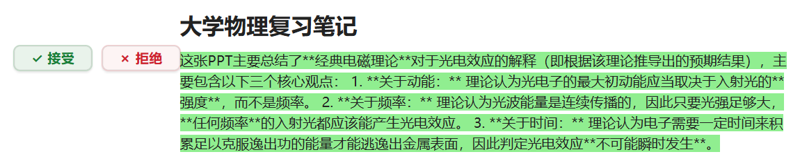
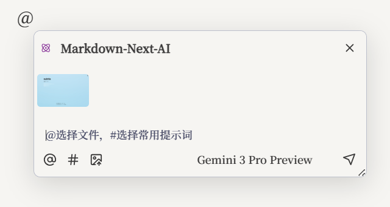
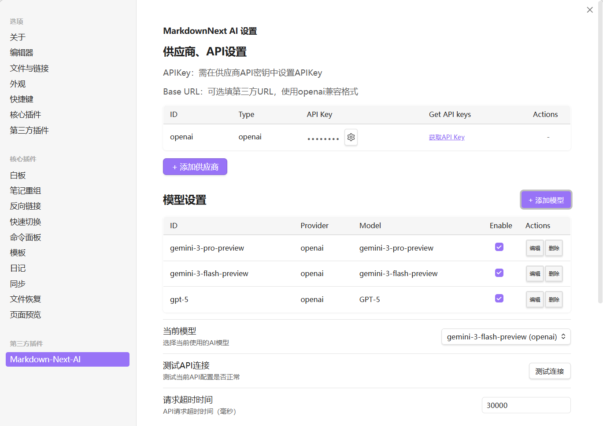

# MarkdownNext AI

**MarkdownNext AI** 是一个深度集成到 Obsidian 的 AI 助手插件。它不仅仅是一个简单的聊天窗口，更是懂你笔记上下文的智能写作伴侣。

通过强大的上下文感知、灵活的模型管理以及自定义提示词系统，它能帮助你完成从灵感捕捉、内容润色到全文续写的各项任务。

## ✨ 核心特性

### 1. 🤖 沉浸式 AI 写作与润色
支持智能续写与内容润色。生成的内容会以高亮形式直接嵌入文档，提供 **接受/拒绝** 浮窗，让你像处理代码合并一样处理文字，保持思维不被打断。

### 2. 🎯 上下文感知与引用
文档中输入 `@` 将唤出对话框。AI 将读取你引用的文件内容作为背景知识，实现真正的"基于笔记对话"。

### 3. ⚡️ 高效的快捷指令与提示词管理
内置常用的写作指令（如扩写、摘要、润色、翻译）。你可以在设置中**自定义添加、编辑或删除**这些提示词，打造专属的写作工作流。

### 4. 🛠️ 强大的多模型支持
支持 OpenAI 格式的任意 API（包括 Gemini, Claude, DeepSeek 等中转服务）。你可以添加多个模型配置，并为不同的任务（如写作、看图、逻辑推理）指定不同的默认模型。

---

## 🚀 功能清单

*   **全能 AI 写作助手**: 深度集成 Obsidian，支持智能续写、内容润色、文本摘要、翻译等多种写作任务。
*   **智能上下文感知**: 通过 `@` 快速引用笔记文件或文件夹，让 AI 读取你的知识库作为背景信息，实现真正的“基于笔记对话”。
*   **多模态交互体验**:支持粘贴或上传图片，利用多模态模型进行深度分析。
*   **灵活的模型管理**:兼容 OpenAI 格式的所有 API（如 GPT-4, Claude 3, Gemini, DeepSeek 等）。
*   **沉浸式写作流**:
    *   **流式输出**: 实时显示 AI 生成内容，无需等待。
    *   **内联操作**: 生成内容直接嵌入文档，提供“接受/拒绝”选项，像代码合并一样高效处理文字。
*   **高度可定制**:
    *   **自定义提示词**: 内置常用指令，支持自定义快捷指令（`#` 触发）。
    *   **全局规则**: 设置全局 Prompt 规则，让 AI 始终遵循你的写作风格。

## 📦 安装指南

由于本插件尚未上架 Obsidian 社区插件市场，请按照以下步骤手动安装：

1.  下载本仓库最新 Release 中的 `main.js`, `manifest.json`, `styles.css`。
2.  打开您的 Obsidian 仓库文件夹，进入 `.obsidian/plugins` 目录。
3.  创建一个名为 `markdown-next-ai` 的新文件夹。
4.  将下载的三个文件放入该文件夹。
5.  重启 Obsidian，在 **设置** -> **第三方插件** 中启用 "MarkdownNext AI"。

## ⚙️ 配置说明

启用插件后，请进入设置页面进行初始化配置：

### 1. 供应商与 API 设置
* 支持添加多个供应商（Provider）。
* **Base URL**: 默认为 `https://api.openai.com/v1`。如使用中转服务（如 OneAPI），请修改此地址。
* **API Key**: 填入对应的密钥。

### 2. 模型管理 (Model Settings)
* 点击 **"添加模型"** 注册你想要使用的模型 ID（如 `gpt-4o`, `gemini-1.5-pro`）。
* 可以独立启用或禁用特定模型。

### 3. 常用提示词 (Prompts)
* 插件预置了 "内容扩充"、"核心摘要"、"润色优化" 等常用指令。
* 你可以在设置页点击 **"编辑"** 修改其 System Prompt，或点击 **"添加提示词"** 创建新的快捷指令。

## 📖 使用方法

1.  **呼出对话**: 在编辑器任意位置输入 `@` 或使用快捷键呼出 AI 浮窗。
2.  **引用文件**: 对话框输入`@`，引用路径下文件。
3.  **常用提示词**：模仿NotionAI的对话方式，对话框输入`#`唤出快捷指令，可在设置中自定义。
4.  **插入内容**: AI 生成完毕后，点击 "Accept" 即可将内容永久保留在笔记中。

## 🛠️ 开发构建

本项目基于纯 JavaScript 开发，修改 `main.js` 后在 Obsidian 中执行 "Reload Custom Plugins" 即可生效，无需编译。

## License

MIT