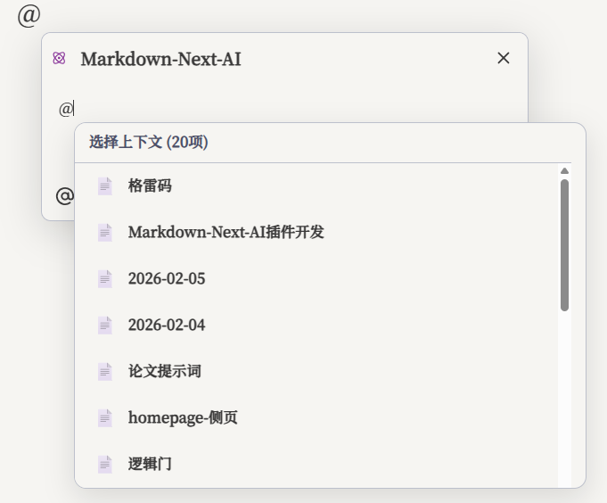
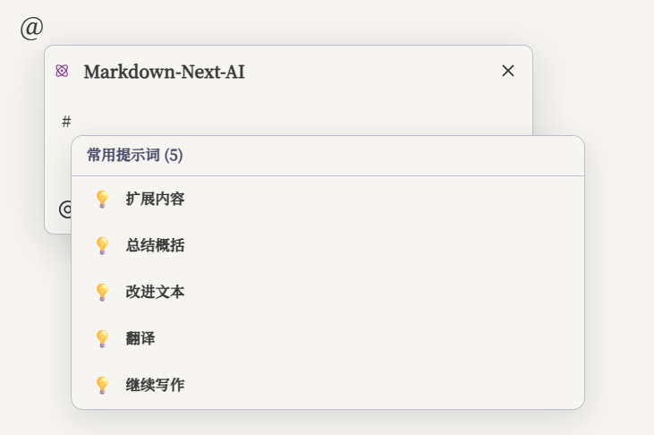
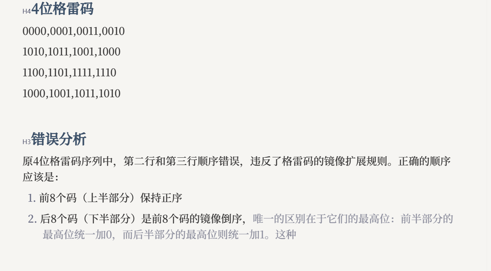

# Markdown Next AI

**Markdown Next AI** 是一个深度集成到 Obsidian 的 AI 助手插件。它不仅仅是一个简单的聊天窗口，更是懂你笔记上下文的智能写作伴侣。

通过强大的上下文感知、灵活的模型管理以及自定义提示词系统，它能帮助你完成从灵感捕捉、内容润色到全文续写的各项任务。

## 📅 更新日志 (v1.7.0)

### ✨ 功能与工作流
* **Ask / Edit / Direct 三模式增强**：对话、Diff 修改、写入更清晰；Direct 支持“写入前 Diff 确认”开关。
* **变更对比视窗（Apply）可定制**：支持视图模式、视觉呈现、操作栏布局、自动跳转与默认决策策略等配置。

### 🧩 模型与配置
* **模型列表自动获取**：支持从 API 拉取可用模型（OpenAI Compatible / Anthropic / Gemini / Ollama）。
* **触发器与快捷系统**：可自定义 @/& 触发规则；`@` 选上下文、`#` 选常用提示词。

### 🐛 修复与体验
* **弹窗稳定性与交互优化**：修复弹窗异常关闭/位置异常等问题，长文本与 UI 体验持续打磨。
* **主题适配**：暗色主题与高对比度模式显示更一致。

> 详细变更请查看 [CHANGELOG.md](CHANGELOG.md)

---

## ✨ 核心特性

你会喜欢它的原因：
- **三模式工作流**：Ask（问答）/ Edit（生成 Diff）/ Direct（直改写入，可选确认），覆盖“问清楚 → 改得准 → 改得快”。
- **像代码 Review 一样改笔记**：在 Apply 视窗中逐块接受/拒绝/保留原文，并支持自动跳转与默认决策策略。
- **真正的上下文对话**：用 `@` 引用文件/文件夹，让 AI 基于你的笔记库回答与改写。
- **快捷指令系统**：用 `#` 快速检索并插入常用提示词，支持自定义工作流。
- **灵活模型管理**：兼容 OpenAI 格式的任意 API，支持多供应商/多模型切换，并可从 API 拉取模型列表；API Key 支持 Keychain 安全存储。

### 1. 🎯 上下文多模态对话（@ 触发）
- 在文档中输入 `@` 唤出 AI 对话框，支持引用笔记库中的文件或文件夹作为上下文，让回答更贴近你的资料。
- 弹窗顶部支持切换 **Ask / Edit / Direct** 三种模式：问答、Diff 修改与直改写入。

- 支持直接粘贴或上传图片，多模态模型可识别图片内容并进行分析、问答和讨论。

### 2. ⚡️ 快捷指令系统（# 触发）
在对话框输入 `#` 快速调用常用提示词（扩写、摘要、润色、翻译等）。支持自定义添加、编辑指令，打造专属写作工作流。

### 3. 🛠️ 灵活的模型管理（多供应商 + Keychain）
兼容 OpenAI 格式的任意 API（GPT、Claude、Gemini、DeepSeek 等），支持添加多个供应商与模型配置，自由切换使用；支持从 API 拉取可用模型列表；API Key 支持 Keychain 安全存储与复用。

### 4. 🧾 可视化 Diff / Apply（逐段确认）
- 以清晰的差异对比形式展示 AI 的修改建议。
- 支持逐段确认（接受/拒绝/保留原文），并可根据偏好调整视图模式、操作栏布局与自动跳转策略。

### 5. ✨ 选中工具栏 (Selection Toolbar)
选中编辑器中的文字即可唤出快捷工具栏，常用操作触手可及。

- **快速唤出**: 选中文本后，会出现悬浮的 "✨" 图标，鼠标悬停或点击即可展开菜单。
- **即时操作**: 提供 "AI Modify" 等快捷操作，无需记忆快捷键。
- **无缝衔接**: 与 Diff / Apply 视图结合，修改内容一目了然。

### 6. ⚡️ Tab 自动补全 (Tab Completion)
全新的即时文本/代码补全体验，智能预测您的输入，提升写作效率。

- **触发方式**: 在输入过程中，AI 会自动预测后续内容并以灰色虚影显示。
- **接受建议**: 按下 `Tab` 键即可将建议内容填入文档。
- **智能感知**: 能够根据上下文自动判断补全内容，无论是代码片段还是自然语言段落。
- **配置**: 支持自定义触发延迟、上下文长度等参数，满足不同写作习惯。

---

## ⚙️ 配置说明

启用插件后，请进入设置页面进行初始化配置。新版设置界面采用标签页设计，分类更加清晰：

### 1. 模型 (Models)
- **供应商设置**: 
    - 内置 OpenAI, Anthropic, Gemini, DeepSeek, Ollama 等常用供应商。
    - 支持 **添加自定义供应商**，兼容所有 OpenAI 格式的 API。
    - **Keychain 安全存储**: 开启后，API Key 将加密存储在系统钥匙串中，支持在不同供应商间复用 Key。
- **模型管理**: 
    - 添加/编辑模型参数，启用/禁用特定模型。
    - 支持为不同模型指定不同的 Provider。

### 2. 编辑器 (Editor)
- **功能开关**:
    - **启用右键菜单**: 选中文本时显示 AI 处理选项。
    - **启用 @/& 触发**: 输入 `@` 或 `&` 时自动唤出 AI 对话框。
    - **直改模式需确认**: 开启后，Direct 模式写入前显示 Diff 确认。
- **触发器规则**: 支持自定义触发规则（字符串/正则），控制对话弹层的唤出方式。

### 3. 预览 / Apply (Preview)
- **变更对比视窗**: 自定义 Diff / Apply 的呈现方式与交互体验（视图模式、状态标记、自动折叠、操作栏位置/吸附/对齐、自动跳转、默认决策策略等）。

### 4. 补全 (Completion)
- **基础设置**:
    - **启用 Tab 补全**: 开启/关闭编辑器内的自动补全。
    - **补全模型**: 建议选择响应速度快的小型模型（如 gpt-4o-mini, haiku 等）。
    - **触发延迟**: 设置输入停止多久后触发补全。
- **触发策略**:
    - **空闲触发**: 光标静止一段时间后自动触发。
    - **触发器配置**: 自定义触发补全的规则（支持字符串匹配和正则匹配），例如换行时触发、输入特定符号时触发。
- **高级设置 (Advanced)**:
    - **系统提示词**: 自定义补全任务的 System Prompt。
    - **上下文参数**: 调整上下文范围 (Context Range)、最小上下文长度。
    - **模型参数**: Temperature, Top P, Max Tokens 等微调。
    - **额外约束**: 为补全结果添加额外的格式或逻辑约束。
- **Tab 补全快捷键**:
    - 支持在设置中自定义并“录制按键”：接受建议 / 拒绝建议 / 取消建议 / 手动触发。

### 5. 对话 (Chat)
- **全局规则 (Global Rules)**: 
    - 设置适用于所有对话的通用规则（如"始终使用中文"、"保持专业语气"）。
    - 支持启用/禁用全局规则。
- **常用提示词 (Prompts)**: 
    - 管理在对话框中通过 `#` 快速调用的提示词模板。
    - 支持添加、编辑、删除自定义提示词。
- **对话快捷键**:
    - 可在 Obsidian「设置 → 快捷键」中为插件命令（如“唤出AI对话框”）设置/修改快捷键。

### 6. 其他 (Others)
- **连接测试**: 一键测试当前 API 配置是否连通。
- **全局参数**:
    - **请求超时**: 设置 API 请求的全局超时时间。
    - **最大 Token 数**: 限制 AI 生成文本的最大长度。

---

## 📦 安装指南

由于本插件尚未上架 Obsidian 社区插件市场，请按照以下步骤手动安装：

1. 下载本仓库最新 Release 中的 `main.js`, `manifest.json`, `styles.css`, `data.json`。
2. 打开您的 Obsidian 仓库文件夹，进入 `.obsidian/plugins` 目录。
3. 创建一个名为 `markdown-next-ai` 的新文件夹。
4. 将下载的文件放入该文件夹。
5. 重启 Obsidian，在 **设置** -> **第三方插件** 中启用 "Markdown Next AI"。
