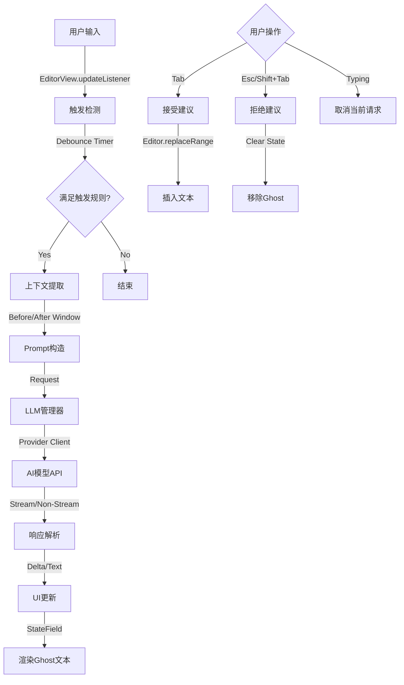

# Yolo自动补全系统技术文档

## 项目进度追踪
- [x] **基础架构与类型定义** (`types.ts`, `defaults.ts`)
- [x] **配置界面** (`settings.ts`)
- [x] **UI 组件** (`inline-suggestion.ts`)
- [x] **AI 服务扩展** (`ai-service.ts`)
- [x] **核心控制器** (`tab-completion-controller.ts`)
- [ ] **主程序集成** (`main.ts`)

## 1. 架构概览



## 2. 核心模块解析

### ✅ 2.1 触发器逻辑 (Trigger Logic)
- **实现类**: `TabCompletionController` (`src/features/tab-completion/tab-completion-controller.ts`)
- **状态**: 已完成
- **监听机制**: 使用 CodeMirror 的 `EditorView.updateListener` 监听文档变更 (`docChanged`)。
- **触发规则**:
  - **自动触发**: 当 `idleTriggerEnabled` 为 true 时，使用 `autoTriggerDelayMs` (默认值) 进行防抖触发。
  - **正则匹配**: `shouldTrigger` 方法检查光标前的文本 (`beforeWindow`) 是否匹配预定义的正则规则 (`TabCompletionTrigger`)。
  - **上下文检测**: 通过 `extractMaskedContext` 提取光标前 (`maxBeforeChars`) 和光标后 (`maxAfterChars`) 的文本，确保有足够的上下文且不处于无效状态（如选区非空）。

### ✅ 2.2 请求封装 (Request Encapsulation)
- **实现类**: 
  - `TabCompletionController` (组装请求)
  - `AIService` (`src/services/ai-service.ts`, 扩展了 `streamCompletion` 方法)
- **状态**: 已完成
- **Prompt构造**:
  - 系统提示词: 可配置的 `systemPrompt`。
  - 用户内容: 包含上下文 (`before` + `<mask/>` + `after`)。
- **请求参数**:
  - `stream`: 强制 `true`。
  - `max_tokens`: 默认 50 或根据配置。
  - `temperature`: 默认 0.2 (低随机性)。
- **生命周期**: 使用 `AbortController` 和 `AbortSignal` 管理请求取消。

### ✅ 2.3 响应解析 (Response Parsing)
- **状态**: 已完成
- **处理逻辑**: 在 `TabCompletionController.run` 方法中配合 `AIService.streamCompletion` 处理。
- **流式处理**: 
  - 实时接收 chunk。
  - 累加文本。
  - 调用 `updateSuggestion` 更新 Ghost Text。

### ✅ 2.4 UI渲染 (UI Rendering)
- **实现类**: 
  - `InlineSuggestionGhostWidget` (`src/ui/inline-suggestion/inline-suggestion.ts`)
  - `inlineSuggestionGhostField` (`src/ui/inline-suggestion/inline-suggestion.ts`)
- **状态**: 已完成
- **技术栈**: CodeMirror `StateField` + `Decoration.widget`。
- **渲染方式**:
  - 创建 `InlineSuggestionGhostWidget`。
  - 通过 `StateField` 挂载到光标位置。

### ✅ 2.5 Tab接受处理 (Tab Acceptance)
- **状态**: 已完成
- **交互绑定**: 
  - `TabCompletionController.createExtension` 注册高优先级 `keymap`。
  - 键位: `Tab` (接受), `Escape` (清除建议)。
- **接受逻辑**:
  - `tryAccept` 方法。
  - 校验光标位置一致性。
  - 使用 `editor.replaceRange` 插入建议文本。

## 3. 接口定义

### 3.1 TabCompletionController 核心接口

| 方法名 | 参数 | 返回类型 | 说明 |
| :--- | :--- | :--- | :--- |
| `createTriggerExtension` | 无 | `Extension` | 创建 CodeMirror 更新监听扩展 |
| `handleEditorChange` | `editor: Editor` | `void` | 处理编辑器变更，触发或重置补全 |
| `run` | `editor: Editor`, `offset: number` | `Promise<void>` | 执行补全请求的核心逻辑 |
| `tryAcceptFromView` | `view: EditorView` | `boolean` | 尝试接受当前的 Ghost 建议 |
| `cancelRequest` | 无 | `void` | 取消当前正在进行的 AI 请求 |

### 3.2 LLMProvider 接口 (部分)

| 方法名 | 参数 | 返回类型 | 说明 |
| :--- | :--- | :--- | :--- |
| `streamResponse` | `model: ChatModel`, `req: LLMRequestStreaming`, `opt?: LLMOptions` | `Promise<AsyncIterable<LLMResponseStreaming>>` | 发送流式请求 |
| `generateResponse` | `model: ChatModel`, `req: LLMRequestNonStreaming`, `opt?: LLMOptions` | `Promise<LLMResponseNonStreaming>` | 发送非流式请求 |

## 4. 输出格式 (JSON Schema)

### 4.1 Request Payload (OpenAI Compatible)

```json
{
  "model": "gpt-4o-mini",
  "messages": [
    {
      "role": "system",
      "content": "You are a text completion engine..."
    },
    {
      "role": "user",
      "content": "File title: My Notes\n\nContext before<mask/>Context after"
    }
  ],
  "stream": true,
  "max_tokens": 128,
  "temperature": 0.1,
  "top_p": 1
}
```

### 4.2 Response Payload (Streaming Chunk)

```json
{
  "id": "chatcmpl-123",
  "object": "chat.completion.chunk",
  "created": 1694268190,
  "model": "gpt-4o-mini",
  "choices": [
    {
      "index": 0,
      "delta": {
        "content": " suggested text"
      },
      "finish_reason": null
    }
  ]
}
```

### 4.3 真实请求/响应示例

#### 示例 1: 简单补全
**Request User Content**:
```
File title: Daily Note
Today is a good day to start l<mask/>
```
**Response (Accumulated)**:
```
earning something new.
```

#### 示例 2: 代码补全
**Request User Content**:
```
File title: utils.ts
function add(a: number, b: number) {
  return<mask/>
}
```
**Response (Accumulated)**:
```
 a + b;
```

#### 示例 3: 列表补全
**Request User Content**:
```
File title: Shopping List
- Apples
- Bananas
-<mask/>
```
**Response (Accumulated)**:
```
 Oranges
```

## 5. 配置项清单

### ✅ 已实现配置 (Implemented)
以下配置项已合并入 `PluginSettings` 的 `tabCompletion` 字段：

| 字段名 | 类型 | 默认值 | 说明 |
| :--- | :--- | :--- | :--- |
| `enabled` | `boolean` | `true` | 是否启用 Tab 自动补全总开关 |
| `modelId` | `string` | `""` | 专用于补全的模型 ID (若空则使用通用续写模型) |
| `systemPrompt` | `string` | (内置默认值) | 覆盖默认的系统提示词 |
| `maxSuggestionLength` | `number` | `100` | 建议文本的最大长度 (字符数) |
| `contextRange` | `number` | `2000` | 发送给 AI 的上下文窗口大小 |
| `idleTriggerEnabled` | `boolean` | `true` | 是否在停止输入后自动触发 |
| `autoTriggerDelayMs` | `number` | `500` | 自动触发的静默等待时间 |
| `triggerDelayMs` | `number` | `2000` | 手动触发(如果有)的延迟 |
| `autoTriggerCooldownMs` | `number` | `0` | 两次自动触发之间的冷却时间 |
| `triggers` | `TabCompletionTrigger[]` | (内置正则) | 触发补全的正则规则列表 |
