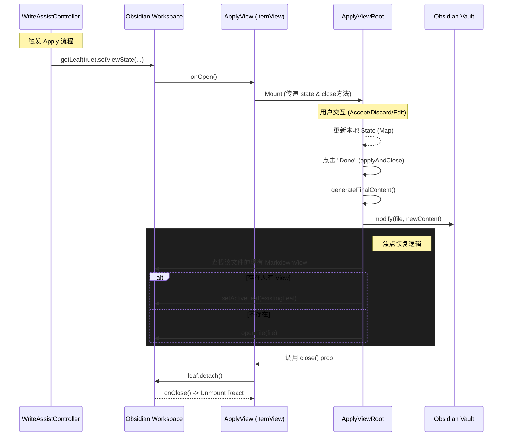

toolName: view_folder
            
status: success
          
d:\Microsoft VS Code\PYTHON\FlowText\test_ai\.obsidian\plugins
          

        
            
toolName: view_files
            
status: success
          
            
filePath: d:\Microsoft VS Code\PYTHON\FlowText\test_ai\.obsidian\plugins\obsidian-yolo-1.4.13\obsidian-yolo-1.4.13\src\ApplyView.tsx
          

        
            
toolName: search_by_regex
            
status: success
          
query: APPLY_VIEW_TYPE
          

        
            
toolName: search_by_regex
            
status: success
          
query: APPLY_VIEW_TYPE
          

        
            
toolName: view_files
            
status: success
          
            
filePath: d:\Microsoft VS Code\PYTHON\FlowText\test_ai\.obsidian\plugins\obsidian-yolo-1.4.13\obsidian-yolo-1.4.13\src\main.ts
          

        
            
toolName: search_by_regex
            
status: success
          
query: registerView
          

        
            
toolName: view_files
            
status: success
          
            
filePath: d:\Microsoft VS Code\PYTHON\FlowText\test_ai\.obsidian\plugins\obsidian-yolo-1.4.13\obsidian-yolo-1.4.13\src\main.ts
          

        
            
toolName: search_by_regex
            
status: success
          
query: onload
          

        
            
toolName: view_files
            
status: success
          
            
filePath: d:\Microsoft VS Code\PYTHON\FlowText\test_ai\.obsidian\plugins\obsidian-yolo-1.4.13\obsidian-yolo-1.4.13\src\main.ts
          

        
            
toolName: search_by_regex
            
status: success
          
query: async onload
          

        
            
toolName: view_files
            
status: success
          
            
filePath: d:\Microsoft VS Code\PYTHON\FlowText\test_ai\.obsidian\plugins\obsidian-yolo-1.4.13\obsidian-yolo-1.4.13\src\main.ts
          

        
            
toolName: search_by_regex
            
status: success
          
query: async onload
          

        
            
toolName: search_by_regex
            
status: success
          
query: async onload
          

        
            
toolName: view_files
            
status: success
          
            
filePath: d:\Microsoft VS Code\PYTHON\FlowText\test_ai\.obsidian\plugins\obsidian-yolo-1.4.13\obsidian-yolo-1.4.13\src\main.ts
          

        
            
toolName: search_by_regex
            
status: success
          
query: APPLY_VIEW_TYPE
          

        
            
toolName: view_files
            
status: success
          
            
filePath: d:\Microsoft VS Code\PYTHON\FlowText\test_ai\.obsidian\plugins\obsidian-yolo-1.4.13\obsidian-yolo-1.4.13\src\features\editor\write-assist\writeAssistController.ts
          

        
            
toolName: search_by_regex
            
status: success
          
query: APPLY_VIEW_TYPE
          

        
            
toolName: search_by_regex
            
status: success
          
query: APPLY_VIEW_TYPE
          

        
            
toolName: view_files
            
status: success
          
            
filePath: d:\Microsoft VS Code\PYTHON\FlowText\test_ai\.obsidian\plugins\obsidian-yolo-1.4.13\obsidian-yolo-1.4.13\src\features\editor\write-assist\writeAssistController.ts
          

        
            
toolName: view_files
            
status: success
          
            
filePath: d:\Microsoft VS Code\PYTHON\FlowText\test_ai\.obsidian\plugins\obsidian-yolo-1.4.13\obsidian-yolo-1.4.13\src\components\apply-view\ApplyViewRoot.tsx
          

        
            
toolName: view_files
            
status: success
          
            
filePath: d:\Microsoft VS Code\PYTHON\FlowText\test_ai\.obsidian\plugins\obsidian-yolo-1.4.13\obsidian-yolo-1.4.13\src\components\apply-view\ApplyViewRoot.tsx
          

        
            
toolName: view_files
            
status: success
          
            
filePath: d:\Microsoft VS Code\PYTHON\FlowText\test_ai\.obsidian\plugins\obsidian-yolo-1.4.13\obsidian-yolo-1.4.13\src\components\apply-view\ApplyViewRoot.tsx
          

        
            
toolName: view_folder
            
status: success
          
d:\Microsoft VS Code\PYTHON\FlowText\test_ai\.obsidian\plugins\obsidian-yolo-1.4.13\obsidian-yolo-1.4.13
          

        
            
toolName: file_search
            
status: success
          
file_pattern: **/*.css
          

        
            
toolName: view_files
            
status: success
          
            
filePath: d:\Microsoft VS Code\PYTHON\FlowText\test_ai\.obsidian\plugins\obsidian-yolo-1.4.13\obsidian-yolo-1.4.13\styles.css
          

        
            
toolName: search_by_regex
            
status: success
          
query: smtcmp-apply-view
          

        
          

        
            
toolName: CompactFake
            
status: success
          
          

        
            
toolName: view_files
            
status: success
          
            
filePath: d:\Microsoft VS Code\PYTHON\FlowText\test_ai\.obsidian\plugins\obsidian-yolo-1.4.13\obsidian-yolo-1.4.13\styles.css
          

        
            
toolName: view_files
            
status: success
          
            
filePath: d:\Microsoft VS Code\PYTHON\FlowText\test_ai\.obsidian\plugins\obsidian-yolo-1.4.13\obsidian-yolo-1.4.13\src\ApplyView.tsx
          

        
            
toolName: search_by_regex
            
status: success
          
query: (diff|toolbar-btn)
          

        
            
toolName: search_by_regex
            
status: success
          
query: (diff|toolbar-btn)
          

        
            
toolName: search_by_regex
            
status: success
          
query: (diff|toolbar-btn)
          

        
            
toolName: view_files
            
status: success
          
            
filePath: d:\Microsoft VS Code\PYTHON\FlowText\test_ai\.obsidian\plugins\obsidian-yolo-1.4.13\obsidian-yolo-1.4.13\styles.css
          

        
            
toolName: search_by_regex
            
status: success
          
query: --smtcmp-(incoming|current)-color-rgb
          

        
            
toolName: search_by_regex
            
status: success
          
query: --smtcmp-(incoming|current)-color-rgb
          
以下是针对 `obsidian-yolo-1.4.13` 的 ApplyView 机制深度逆向分析报告，重点拆解了运行生命周期与颜色主题系统，并提供了 Markdown-Next-AI 的技术复刻指南。

# `obsidian-yolo` ApplyView 机制逆向分析报告

## 1. 运行生命周期 (Execution Lifecycle)

ApplyView 的生命周期由 `WriteAssistController` 发起，通过 Obsidian 的 Workspace API 进行视图注入，最终在 React 组件内部完成逻辑闭环并销毁视图。

### 1.1 核心流程拆解

1.  **注入阶段 (Injection)**:
    *   **入口**: `WriteAssistController.ts` 中的 `handleApply` 方法（或其他触发点）。
    *   **机制**: 使用 `app.workspace.getLeaf(true).setViewState(...)`。关键是 `active: true` 确保立即激活，且通过 `state` 对象传递 `activeFile`、`originalContent` 和 `newContent` 数据，无需全局 store 中转。
2.  **渲染阶段 (Rendering)**:
    *   **容器**: `ApplyView.tsx` 继承自 `ItemView`。
    *   **挂载**: 在 `onOpen()` 中使用 `createRoot` 挂载 `ApplyViewRoot` React 组件。
    *   **通信**: `ApplyView` 将 `close` 方法作为 prop 传递给 `ApplyViewRoot`，实现了 React 层对 Obsidian Leaf 的控制反转。
3.  **决策与关闭 (Decision & Closing)**:
    *   **逻辑**: 用户在 UI 操作（Accept/Reject）仅更新 React 内部状态（Map）。
    *   **应用**: 点击 "Done" 时触发 `applyAndClose`。
    *   **原子写入**: 计算最终文本后，一次性调用 `app.vault.modify` 写入文件。
    *   **焦点恢复**: 写入后，逻辑尝试寻找该文件已存在的 `MarkdownView` 并聚焦；若无，则重新打开该文件。最后调用 `close()` 销毁 ApplyView。

### 1.2 事件序列图 (Mermaid)



---

## 2. 颜色主题系统 (Color Theming System)

该插件的颜色系统采用了 **"Obsidian 原生变量 + 自定义 RGB 变量"** 的混合模式，既保证了与当前主题的融合，又通过 RGB 变量实现了透明度（Alpha channel）的灵活控制。

### 2.1 关键机制
*   **Diff 语义色**: 定义了 `--smtcmp-incoming-color-rgb` (绿) 和 `--smtcmp-current-color-rgb` (红) 两个核心 RGB 变量。
*   **透明度控制**: 使用 `rgba(var(--custom-rgb), 0.3)` 的方式，在不引入 Sass/Less 的情况下实现背景色的浅色变体。
*   **主题适配**: 按钮和边框大量复用 `var(--interactive-accent)` 和 `var(--background-modifier-border)`，自动适配 Obsidian 的明/暗模式及第三方主题。

### 2.2 关键颜色变量映射表

| UI 组件 / 状态 | CSS 选择器 / 变量 | 颜色值 / 逻辑 | 视觉效果 |
| :--- | :--- | :--- | :--- |
| **新增段落背景** | `.smtcmp-diff-block.added` | `rgba(var(--smtcmp-incoming-color-rgb), 0.3)` | 🟩 浅绿色背景 (透明度 0.3) |
| **删除段落背景** | `.smtcmp-diff-block.removed` | `rgba(var(--smtcmp-current-color-rgb), 0.3)` | 🟥 浅红色背景 (透明度 0.3) |
| **Accept 按钮** | `.smtcmp-accept` | `rgba(var(--smtcmp-incoming-color-rgb), 0.8)` | 🟩 深绿色按钮 |
| **Reject 按钮** | `.smtcmp-exclude` | `rgba(var(--smtcmp-current-color-rgb), 0.8)` | 🟥 深红色按钮 |
| **主要操作按钮** | `.smtcmp-apply-btn` | `var(--interactive-accent)` | 🟣 主题色 (如紫色) |
| **通用按钮背景** | `.smtcmp-toolbar-btn` | `var(--background-primary)` | ⬜ 默认背景色 |
| **通用按钮边框** | `.smtcmp-toolbar-btn` | `var(--background-modifier-border)` | 🌑 默认边框色 |
| **Incoming 基色** | `--smtcmp-incoming-color-rgb` | `4, 120, 87` | Emerald-700 (深绿) |
| **Current 基色** | `--smtcmp-current-color-rgb` | `185, 28, 28` | Red-700 (深红) |

---

## 3. Markdown-Next-AI 复刻指南

以下是将此机制移植到 Markdown-Next-AI 的最小化可执行步骤。

### 步骤 1: 定义 View Type 与常量
在 `src/constants.ts` 中定义视图 ID。

```typescript
export const APPLY_VIEW_TYPE = 'markdown-next-ai-apply-view';
export const APPLY_VIEW_ICON = 'check-check'; // 使用双勾图标
```

### 步骤 2: 实现 ApplyView 类
在 `src/ui/apply-view/ApplyView.ts` 中创建视图容器。重点是 `state` 的管理和 `close` 方法的传递。

```typescript
import { ItemView, WorkspaceLeaf, ViewStateResult } from 'obsidian';
import { Root, createRoot } from 'react-dom/client';
import { APPLY_VIEW_TYPE, APPLY_VIEW_ICON } from '../../constants';
import { ApplyViewRoot } from './ApplyViewRoot';

export class ApplyView extends ItemView {
    private root: Root | null = null;
    private state: any = null; // 定义具体的 ApplyViewState 接口

    constructor(leaf: WorkspaceLeaf) {
        super(leaf);
    }

    getViewType() { return APPLY_VIEW_TYPE; }
    getDisplayText() { return 'Review Changes'; }
    getIcon() { return APPLY_VIEW_ICON; }

    async setState(state: any, result?: ViewStateResult): Promise<void> {
        this.state = state;
        this.render();
        return super.setState(state, result);
    }

    async onOpen() {
        this.root = createRoot(this.contentEl);
        this.render();
    }

    async onClose() {
        this.root?.unmount();
    }

    private render() {
        if (!this.root || !this.state) return;
        this.root.render(
            // 传递 close 回调给 React 组件，实现控制反转
            <ApplyViewRoot 
                state={this.state} 
                close={() => this.leaf.detach()} 
            />
        );
    }
}
```

### 步骤 3: CSS 变量注入
在 `styles.css` 中添加核心 RGB 变量，确保颜色系统独立于主题工作。

```css
/* Markdown-Next-AI Apply View Theme */
.theme-dark, .theme-light {
    --mn-incoming-rgb: 4, 120, 87;  /* 保持一致或微调 */
    --mn-current-rgb: 185, 28, 28;
}

.mn-diff-added {
    background-color: rgba(var(--mn-incoming-rgb), 0.3);
}

.mn-diff-removed {
    background-color: rgba(var(--mn-current-rgb), 0.3);
}
```

### 步骤 4: 调用入口
在你的 Controller 或 Command 处理函数中：

```typescript
// 示例调用代码
const leaf = this.app.workspace.getLeaf(true);
await leaf.setViewState({
    type: APPLY_VIEW_TYPE,
    active: true,
    state: {
        file: activeFile,
        originalContent: currentFileContent,
        newContent: generatedContent
    }
});
```