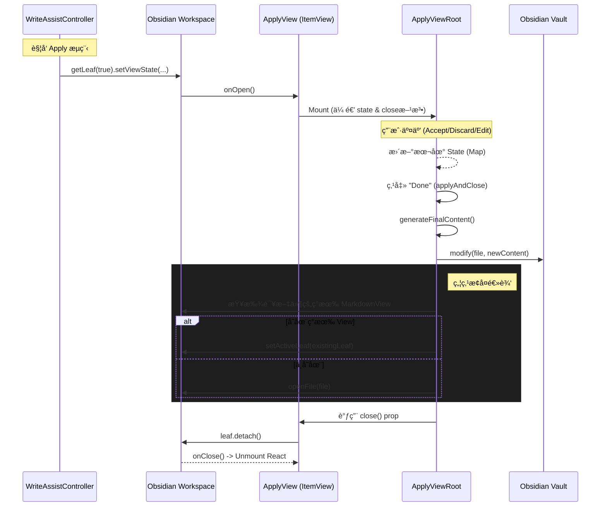

toolName: view_folder
            
status: success
          
d:\Microsoft VS Code\PYTHON\FlowText\test_ai\.obsidian\plugins
          

        
            
toolName: view_files
            
status: success
          
            
filePath: d:\Microsoft VS Code\PYTHON\FlowText\test_ai\.obsidian\plugins\obsidian-yolo-1.4.13\obsidian-yolo-1.4.13\src\ApplyView.tsx
          

        
            
toolName: search_by_regex
            
status: success
          
query: APPLY_VIEW_TYPE
          

        
            
toolName: search_by_regex
            
status: success
          
query: APPLY_VIEW_TYPE
          

        
            
toolName: view_files
            
status: success
          
            
filePath: d:\Microsoft VS Code\PYTHON\FlowText\test_ai\.obsidian\plugins\obsidian-yolo-1.4.13\obsidian-yolo-1.4.13\src\main.ts
          

        
            
toolName: search_by_regex
            
status: success
          
query: registerView
          

        
            
toolName: view_files
            
status: success
          
            
filePath: d:\Microsoft VS Code\PYTHON\FlowText\test_ai\.obsidian\plugins\obsidian-yolo-1.4.13\obsidian-yolo-1.4.13\src\main.ts
          

        
            
toolName: search_by_regex
            
status: success
          
query: onload
          

        
            
toolName: view_files
            
status: success
          
            
filePath: d:\Microsoft VS Code\PYTHON\FlowText\test_ai\.obsidian\plugins\obsidian-yolo-1.4.13\obsidian-yolo-1.4.13\src\main.ts
          

        
            
toolName: search_by_regex
            
status: success
          
query: async onload
          

        
            
toolName: view_files
            
status: success
          
            
filePath: d:\Microsoft VS Code\PYTHON\FlowText\test_ai\.obsidian\plugins\obsidian-yolo-1.4.13\obsidian-yolo-1.4.13\src\main.ts
          

        
            
toolName: search_by_regex
            
status: success
          
query: async onload
          

        
            
toolName: search_by_regex
            
status: success
          
query: async onload
          

        
            
toolName: view_files
            
status: success
          
            
filePath: d:\Microsoft VS Code\PYTHON\FlowText\test_ai\.obsidian\plugins\obsidian-yolo-1.4.13\obsidian-yolo-1.4.13\src\main.ts
          

        
            
toolName: search_by_regex
            
status: success
          
query: APPLY_VIEW_TYPE
          

        
            
toolName: view_files
            
status: success
          
            
filePath: d:\Microsoft VS Code\PYTHON\FlowText\test_ai\.obsidian\plugins\obsidian-yolo-1.4.13\obsidian-yolo-1.4.13\src\features\editor\write-assist\writeAssistController.ts
          

        
            
toolName: search_by_regex
            
status: success
          
query: APPLY_VIEW_TYPE
          

        
            
toolName: search_by_regex
            
status: success
          
query: APPLY_VIEW_TYPE
          

        
            
toolName: view_files
            
status: success
          
            
filePath: d:\Microsoft VS Code\PYTHON\FlowText\test_ai\.obsidian\plugins\obsidian-yolo-1.4.13\obsidian-yolo-1.4.13\src\features\editor\write-assist\writeAssistController.ts
          

        
            
toolName: view_files
            
status: success
          
            
filePath: d:\Microsoft VS Code\PYTHON\FlowText\test_ai\.obsidian\plugins\obsidian-yolo-1.4.13\obsidian-yolo-1.4.13\src\components\apply-view\ApplyViewRoot.tsx
          

        
            
toolName: view_files
            
status: success
          
            
filePath: d:\Microsoft VS Code\PYTHON\FlowText\test_ai\.obsidian\plugins\obsidian-yolo-1.4.13\obsidian-yolo-1.4.13\src\components\apply-view\ApplyViewRoot.tsx
          

        
            
toolName: view_files
            
status: success
          
            
filePath: d:\Microsoft VS Code\PYTHON\FlowText\test_ai\.obsidian\plugins\obsidian-yolo-1.4.13\obsidian-yolo-1.4.13\src\components\apply-view\ApplyViewRoot.tsx
          

        
            
toolName: view_folder
            
status: success
          
d:\Microsoft VS Code\PYTHON\FlowText\test_ai\.obsidian\plugins\obsidian-yolo-1.4.13\obsidian-yolo-1.4.13
          

        
            
toolName: file_search
            
status: success
          
file_pattern: **/*.css
          

        
            
toolName: view_files
            
status: success
          
            
filePath: d:\Microsoft VS Code\PYTHON\FlowText\test_ai\.obsidian\plugins\obsidian-yolo-1.4.13\obsidian-yolo-1.4.13\styles.css
          

        
            
toolName: search_by_regex
            
status: success
          
query: smtcmp-apply-view
          

        
          

        
            
toolName: CompactFake
            
status: success
          
          

        
            
toolName: view_files
            
status: success
          
            
filePath: d:\Microsoft VS Code\PYTHON\FlowText\test_ai\.obsidian\plugins\obsidian-yolo-1.4.13\obsidian-yolo-1.4.13\styles.css
          

        
            
toolName: view_files
            
status: success
          
            
filePath: d:\Microsoft VS Code\PYTHON\FlowText\test_ai\.obsidian\plugins\obsidian-yolo-1.4.13\obsidian-yolo-1.4.13\src\ApplyView.tsx
          

        
            
toolName: search_by_regex
            
status: success
          
query: (diff|toolbar-btn)
          

        
            
toolName: search_by_regex
            
status: success
          
query: (diff|toolbar-btn)
          

        
            
toolName: search_by_regex
            
status: success
          
query: (diff|toolbar-btn)
          

        
            
toolName: view_files
            
status: success
          
            
filePath: d:\Microsoft VS Code\PYTHON\FlowText\test_ai\.obsidian\plugins\obsidian-yolo-1.4.13\obsidian-yolo-1.4.13\styles.css
          

        
            
toolName: search_by_regex
            
status: success
          
query: --smtcmp-(incoming|current)-color-rgb
          

        
            
toolName: search_by_regex
            
status: success
          
query: --smtcmp-(incoming|current)-color-rgb
          
以下是针对 `obsidian-yolo-1.4.13` çš„ ApplyView 机制深度逆å‘分æ报告，é‡ç‚¹æ‹†è§£äº†è¿è¡Œç”Ÿå‘½å‘¨æœŸä¸é¢œè‰²ä¸»é¢˜ç³»ç»Ÿï¼Œå¹¶æ供了 Markdown-Next-AI 的技术å¤åˆ»æŒ‡å—。

# `obsidian-yolo` ApplyView 机制逆å‘分æ报告

## 1. è¿è¡Œç”Ÿå‘½å‘¨æœŸ (Execution Lifecycle)

ApplyView 的生命周期由 `WriteAssistController` å‘起，通过 Obsidian çš„ Workspace API 进行视图注入，最终在 React 组件内部完æˆé€»è¾‘é—­ç¯å¹¶é”€æ¯è§†å›¾ã€‚

### 1.1 核心æµç¨‹æ‹†è§£

1.  **注入阶段 (Injection)**:
    *   **å…¥å£**: `WriteAssistController.ts` 中的 `handleApply` 方法（或其他触å‘点）。
    *   **机制**: 使用 `app.workspace.getLeaf(true).setViewState(...)`。关键是 `active: true` ç¡®ä¿ç«‹å³æ¿€æ´»ï¼Œä¸”通过 `state` 对象传递 `activeFile`ã€`originalContent` å’Œ `newContent` æ•°æ®ï¼Œæ— éœ€å…¨å±€ store 中转。
2.  **渲染阶段 (Rendering)**:
    *   **容器**: `ApplyView.tsx` 继承自 `ItemView`。
    *   **挂载**: 在 `onOpen()` 中使用 `createRoot` 挂载 `ApplyViewRoot` React 组件。
    *   **通信**: `ApplyView` å°† `close` 方法作为 prop 传递给 `ApplyViewRoot`，å®ç°äº† React 层对 Obsidian Leaf çš„æ§åˆ¶å转。
3.  **决策ä¸å…³é—­ (Decision & Closing)**:
    *   **逻辑**: 用户在 UI æ“作（Accept/Reject）仅更新 React 内部状æ€ï¼ˆMap）。
    *   **应用**: 点击 "Done" æ—¶è§¦å‘ `applyAndClose`。
    *   **åŸå­å†™å…¥**: 计算最终文本å，一次性调用 `app.vault.modify` 写入文件。
    *   **焦点æ¢å¤**: 写入å，逻辑å°è¯•å¯»æ‰¾è¯¥æ–‡ä»¶å·²å­˜åœ¨çš„ `MarkdownView` 并èšç„¦ï¼›è‹¥æ— ï¼Œåˆ™é‡æ–°æ‰“开该文件。最å调用 `close()` é”€æ¯ ApplyView。

### 1.2 事件åºåˆ—图 (Mermaid)



---

## 2. 颜色主题系统 (Color Theming System)

该æ’件的颜色系统采用了 **"Obsidian åŸç”Ÿå˜é‡ + 自定义 RGB å˜é‡"** çš„æ··åˆæ¨¡å¼ï¼Œæ—¢ä¿è¯äº†ä¸å½“å‰ä¸»é¢˜çš„èåˆï¼Œåˆé€šè¿‡ RGB å˜é‡å®ç°äº†é€æ˜åº¦ï¼ˆAlpha channel）的çµæ´»æ§åˆ¶ã€‚

### 2.1 关键机制
*   **Diff 语义色**: 定义了 `--smtcmp-incoming-color-rgb` (绿) å’Œ `--smtcmp-current-color-rgb` (红) 两个核心 RGB å˜é‡ã€‚
*   **é€æ˜åº¦æ§åˆ¶**: 使用 `rgba(var(--custom-rgb), 0.3)` çš„æ–¹å¼ï¼Œåœ¨ä¸å¼•å…¥ Sass/Less 的情况下å®ç°èƒŒæ™¯è‰²çš„浅色å˜ä½“。
*   **主题适é…**: 按钮和边框大é‡å¤ç”¨ `var(--interactive-accent)` å’Œ `var(--background-modifier-border)`ï¼Œè‡ªåŠ¨é€‚é… Obsidian çš„æ˜/暗模å¼åŠç¬¬ä¸‰æ–¹ä¸»é¢˜ã€‚

### 2.2 关键颜色å˜é‡æ˜ å°„表

| UI 组件 / çŠ¶æ€ | CSS 选择器 / å˜é‡ | 颜色值 / 逻辑 | è§†è§‰æ•ˆæœ |
| :--- | :--- | :--- | :--- |
| **æ–°å¢æ®µè½èƒŒæ™¯** | `.smtcmp-diff-block.added` | `rgba(var(--smtcmp-incoming-color-rgb), 0.3)` | 🟩 浅绿色背景 (é€æ˜åº¦ 0.3) |
| **删除段è½èƒŒæ™¯** | `.smtcmp-diff-block.removed` | `rgba(var(--smtcmp-current-color-rgb), 0.3)` | 🟥 浅红色背景 (é€æ˜åº¦ 0.3) |
| **Accept 按钮** | `.smtcmp-accept` | `rgba(var(--smtcmp-incoming-color-rgb), 0.8)` | 🟩 深绿色按钮 |
| **Reject 按钮** | `.smtcmp-exclude` | `rgba(var(--smtcmp-current-color-rgb), 0.8)` | 🟥 深红色按钮 |
| **主è¦æ“作按钮** | `.smtcmp-apply-btn` | `var(--interactive-accent)` | 🟣 主题色 (如紫色) |
| **通用按钮背景** | `.smtcmp-toolbar-btn` | `var(--background-primary)` | ⬜ 默认背景色 |
| **通用按钮边框** | `.smtcmp-toolbar-btn` | `var(--background-modifier-border)` | 🌑 默认边框色 |
| **Incoming 基色** | `--smtcmp-incoming-color-rgb` | `4, 120, 87` | Emerald-700 (深绿) |
| **Current 基色** | `--smtcmp-current-color-rgb` | `185, 28, 28` | Red-700 (深红) |

---

## 3. Markdown-Next-AI å¤åˆ»æŒ‡å—

以下是将此机制移æ¤åˆ° Markdown-Next-AI 的最å°åŒ–å¯æ‰§è¡Œæ­¥éª¤ã€‚

### 步骤 1: 定义 View Type ä¸å¸¸é‡
在 `src/constants.ts` 中定义视图 ID。

```typescript
export const APPLY_VIEW_TYPE = 'markdown-next-ai-apply-view';
export const APPLY_VIEW_ICON = 'check-check'; // 使用åŒå‹¾å›¾æ ‡
```

### 步骤 2: å®ç° ApplyView ç±»
在 `src/ui/apply-view/ApplyView.ts` 中创建视图容器。é‡ç‚¹æ˜¯ `state` 的管ç†å’Œ `close` 方法的传递。

```typescript
import { ItemView, WorkspaceLeaf, ViewStateResult } from 'obsidian';
import { Root, createRoot } from 'react-dom/client';
import { APPLY_VIEW_TYPE, APPLY_VIEW_ICON } from '../../constants';
import { ApplyViewRoot } from './ApplyViewRoot';

export class ApplyView extends ItemView {
    private root: Root | null = null;
    private state: any = null; // 定义具体的 ApplyViewState æ¥å£

    constructor(leaf: WorkspaceLeaf) {
        super(leaf);
    }

    getViewType() { return APPLY_VIEW_TYPE; }
    getDisplayText() { return 'Review Changes'; }
    getIcon() { return APPLY_VIEW_ICON; }

    async setState(state: any, result?: ViewStateResult): Promise<void> {
        this.state = state;
        this.render();
        return super.setState(state, result);
    }

    async onOpen() {
        this.root = createRoot(this.contentEl);
        this.render();
    }

    async onClose() {
        this.root?.unmount();
    }

    private render() {
        if (!this.root || !this.state) return;
        this.root.render(
            // 传递 close å›è°ƒç»™ React 组件，å®ç°æ§åˆ¶å转
            <ApplyViewRoot 
                state={this.state} 
                close={() => this.leaf.detach()} 
            />
        );
    }
}
```

### 步骤 3: CSS å˜é‡æ³¨å…¥
在 `styles.css` 中添加核心 RGB å˜é‡ï¼Œç¡®ä¿é¢œè‰²ç³»ç»Ÿç‹¬ç«‹äºä¸»é¢˜å·¥ä½œã€‚

```css
/* Markdown-Next-AI Apply View Theme */
.theme-dark, .theme-light {
    --mn-incoming-rgb: 4, 120, 87;  /* ä¿æŒä¸€è‡´æˆ–微调 */
    --mn-current-rgb: 185, 28, 28;
}

.mn-diff-added {
    background-color: rgba(var(--mn-incoming-rgb), 0.3);
}

.mn-diff-removed {
    background-color: rgba(var(--mn-current-rgb), 0.3);
}
```

### 步骤 4: 调用入å£
在你的 Controller 或 Command 处ç†å‡½æ•°ä¸­ï¼š

```typescript
// 示例调用代ç 
const leaf = this.app.workspace.getLeaf(true);
await leaf.setViewState({
    type: APPLY_VIEW_TYPE,
    active: true,
    state: {
        file: activeFile,
        originalContent: currentFileContent,
        newContent: generatedContent
    }
});
```